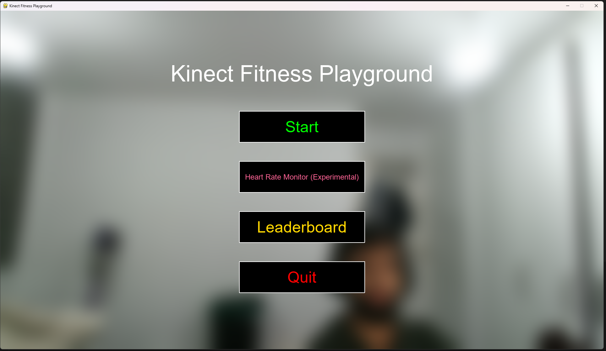

# Kinect Fitness Playground
## Interactive fitness using Microsoft Kinect!

Kinect Fitness Playground is a comprehensive fitness application that utilises the Microsoft Xbox Kinect V2 sensor to track body movements, provide exercise feedback, and monitor workout progress. This project aims to highlight the utility of the Kinect sensor and demonstrate how it can be adapted for a wide range of use cases.



## Features

### Exercise Tracking
- Squats  
- Jumping Jacks  
- Bicep Curls  
- Arm Raises  
- Free mode  

**Real-time Feedback**: Visual and text feedback on exercise form and techniques  
**Rep Counting**: Automatic counting of completed repetitions  
**Visual Skeleton Tracking**: Displays a visual representation of tracked skeletal joints

### Heart Rate Monitoring (Experimental)
- Visual heart rate detection using Photoplethysmography  
- Signal quality indicators showing the quality of the heart rate detected  
- Forehead detection and confidence indicators

### Performance Tracking
- Personal leaderboard that tracks your performance across all exercises  
- Detailed statistics that include: Total reps, Form quality scores, Best sessions  
- Historical data allows you to view past performance

## Tech Stack

The Kinect Fitness Playground uses a few cool open source projects to work properly:
- [PyKinect2](https://github.com/Kinect/PyKinect2) - Python wrapper for Kinect for Windows SDK  
- [Pygame](https://www.pygame.org/) - Cross-platform set of Python modules for writing video games  
- [OpenCV](https://opencv.org/) - Open source computer vision library  
- [NumPy](https://numpy.org/) - Fundamental package for scientific computing with Python  
- [SciPy](https://scipy.org/) - Python library used for scientific and technical computing  
- [PIL/Pillow](https://python-pillow.org/) - Python Imaging Library  

## Installation

Kinect Fitness Playground requires [Python](https://www.python.org/downloads/) v3.5.4 to run.  
Install the Kinect for [Windows SDK](https://www.microsoft.com/en-gb/download/details.aspx?id=44561).

#### Clone the repository and install the dependencies:
```sh
git clone https://github.com/yourusername/kinect-fitness-playground.git
cd kinect-fitness-playground
pip install -r requirements.txt
```

#### Run the application:
```sh
python main.py
```

## Configuration

The application was designed to be easily customised through the `config.json` file. This controls various aspects such as:
- Window settings  
- Privacy blur filter (for blog post)  
- Button positions  
- Exercise settings  
- Heart rate monitoring parameters  
- Skeleton visualisation  

## Data Storage

The exercise and performance data is stored in `leaderboard_data.json`. This tracks:
- Exercise sessions  
- Rep counts  
- Form quality  
- Dates and times of workouts  
- Personal bests  

## Contribute

The application is structured in a modular way, split into six main components:

- **Main App**: Central coordinator (`app.py`, `main.py`)  
- **GUI Components**: Menu system and interface elements (`base_menu.py`, `button.py`, etc.)  
- **Exercise Modules**: Individual exercise detection logic (`squats.py`, `jumping_jacks.py`, etc.)  
- **Kinect Interface**: Hardware interaction (`kinect_manager.py`, `skeleton_renderer.py`)  
- **Heart Rate Detection**: Experimental feature (`heart_rate_detector.py`)  
- **Performance Tracking**: Leaderboard and statistics (`leaderboard_manager.py`)  

To add new exercises, create a new exercise class that extends `BaseExercise`, implement the desired detection logic, update the UI to include the new exercise, and finally add the necessary configurations to `config.json`.
